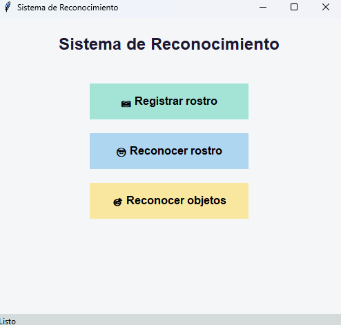
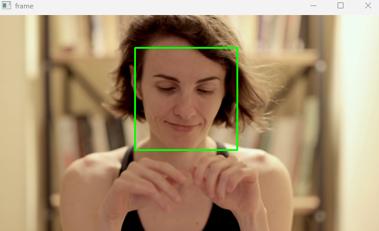

# 🖥️ Sistema de Reconocimiento Facial y de Objetos

Este proyecto es una aplicación de escritorio en **Python (Tkinter)** que permite:

- 📷 **Registrar rostros** con cámara o video y entrenar el modelo.
- 🙂 **Reconocer rostros** previamente registrados.
- 🎯 **Detectar objetos** en imágenes o video.

Todo en una interfaz gráfica sencilla y amigable.

---

## 📸 Vista previa

### Pantalla principal


### Registro de rostro


### Reconocimiento de rostro en acción


### Reconocimiento de objetos


---

## ⚙️ Requisitos

- Python 3.9+
- Librerías necesarias:
  ```bash
  pip install opencv-python tk pillow
